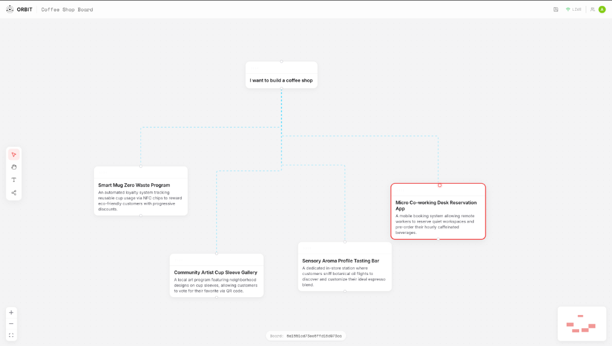

# OrbitCanvas

> The AI-native spatial intelligence canvas for teams that ship fast.

Orbit helps product, design, and engineering teams brainstorm with deep AI assistance. Free your team from linear documents, uncover insights visually, and accelerate planning in a highly interactive, multiplayer workspace.



##  Core Features

###  Spatial Ideation
Effortless structuring, always visual, always connected.
- **Infinite Pan & Zoom:** Never run out of space for your ideas.
- **Visual Relationships:** Draw connections between disconnected concepts effortlessly using intuitive edges.
- **Smart Node Snapping:** Keep your architectural diagrams and brainstorms perfectly aligned.

### Streaming AI (Powered by Gemini 1.5)
High-quality ideas that feel handcrafted, delivered in seconds.
- **Context-Aware Generation:** AI autofills nodes by reading the context of parent nodes and relationships.
- **Real-Time Streaming:** Watch Gemini branch your thoughts into a universe of sub-tasks, architectural components, or brainstorm ideas instantly.
- **Customizable Actions:** Brainstorm, deconstruct, deep dive, or ask custom questions directly inside the canvas.

### Live Collaboration
Absolute alignment across teams in real-time.
- **Multiplayer State:** See changes from teammates instantly without refreshing.
- **Live Cursors:** Track where everyone is working in real-time.
- **Unified Workspace:** Bring notes, APIs, and docs into one living map.

---

## Tech Stack

### Frontend
- **Framework:** React 18, Vite
- **Canvas Engine:** React Flow
- **Styling:** Tailwind CSS, Vanilla CSS (Custom Design System)
- **Animations:** GSAP (ScrollTrigger), Lenis (Smooth Scroll)
- **Routing:** React Router DOM
- **Icons:** Lucide React

### Backend
- **Runtime:** Node.js, Express.js
- **Real-time:** Socket.io
- **Database:** MongoDB (Mongoose)
- **AI Integration:** Google Gemini 1.5 API (`@google/genai`)

---

## Getting Started

### Prerequisites
- Node.js (v18+ recommended)
- MongoDB running locally or a MongoDB Atlas URI
- Google Gemini API Key

### Installation

1. **Clone the repository:**
   ```bash
   git clone https://github.com/prrayag/OrbitCanvas.git
   cd OrbitCanvas
   ```

2. **Install dependencies:**
   ```bash
   # Install root dependencies (concurrently, etc.)
   npm install

   # Install client dependencies
   cd client && npm install

   # Install server dependencies
   cd ../server && npm install
   ```

3. **Set up Environment Variables:**
   Create a `.env` file in the root directory:
   ```env
   PORT=5001
   MONGODB_URI=your_mongodb_connection_string
   GEMINI_API_KEY=your_gemini_api_key
   ```

4. **Run the Application:**
   From the root directory, start both the client and server concurrently:
   ```bash
   npm run dev
   ```
   - Client will run on `http://localhost:5173`
   - Server will run on `http://localhost:5001`

---

## 🛡️ Security Highlights
Built for enterprise-grade security and compliance:
- **Zero Data Retention:** AI queries are never stored or used for model training.
- **Data Isolation:** Workspace sessions run in fully isolated database collections.
- **End-to-End Integrity:** WebSockets secured for safe live collaboration.

---

*Designed and engineered to make complex planning simple.*
